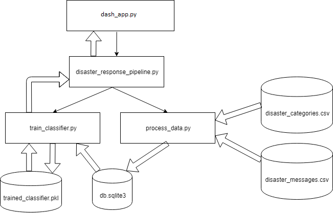
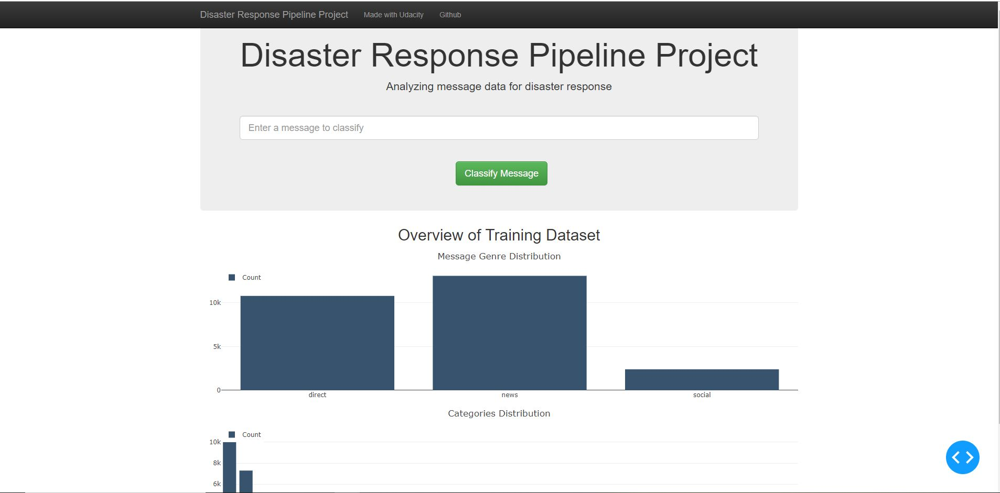
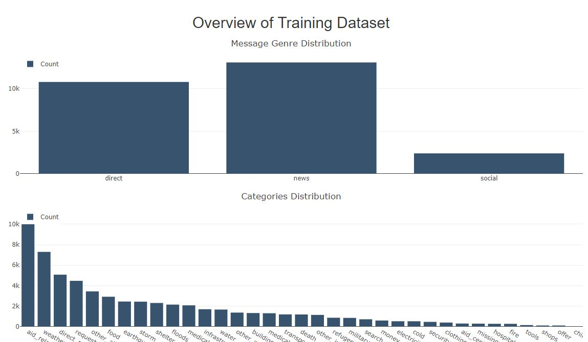
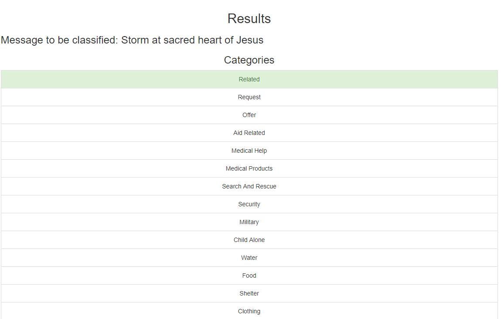

# Disaster Response Pipeline Project

## Introduction

This project is part of The [Udacity](https://eu.udacity.com/) Data Scientist Nanodegree Program which is composed by:
* Term 1
    * Supervised Learning
    * Deep Learning
    * Unsupervised Learning
* Term 2
    * Write A Data Science Blog Post
    * Disaster Response Pipelines
    * Recommendation Engines

The goal of this project is to apply the data engineering skills learned in the course to analyze disaster data from [Figure Eight](https://www.figure-eight.com/) to build a model for an API that classifies disaster messages. The project is divided in three sections:
* **Data Processing**: build an ETL (Extract, Transform, and Load) Pipeline to extract data from the given dataset, clean the data, and then store it in a SQLite database
* **Machine Learning Pipeline**: split the data into a training set and a test set. Then, create a machine learning pipeline that uses NLTK, as well as scikit-learn's Pipeline and GridSearchCV to output a final model that predicts a message classifications for the 36 categories (multi-output classification)
* **Web development** develop a web application to show classify messages in real time

## Software and Libraries

This project uses Python 3.7.2 and the following libraries:
* [NumPy](http://www.numpy.org/)
* [Pandas](http://pandas.pydata.org)
* [nltk](https://www.nltk.org/)
* [scikit-learn](http://scikit-learn.org/stable/)
* [sqlalchemy](https://www.sqlalchemy.org/)
* [dash](https://plot.ly/dash/)

More informations in `requirements.txt`. To create it I have used `python -m pip freeze > requirements.txt`. To install all Python packages written in the requirements.txt file run `pip install -r requirements.txt`.

## Data

The dataset is provided by [Figure Eight](https://www.figure-eight.com/dataset/combined-disaster-response-data/) is basically composed by:
* **disaster_categories.csv**: Categories of the messages
* **disaster_messages.csv**: Multilingual disaster response messages

## Running the code

From the project folder run `python dash_disaster_response_pipeline.py` to start the dash application. The default url to connect to it is http://127.0.0.1:8050/.

<pre>
|-- disaster_response_pipeline_project
    |-- disaster_response_pipeline
    |   |-- data
    |   |   |-- ETL Pipeline Preparation.ipynb
    |   |   |-- process_data.py    
    |   |   |-- disaster_categories.csv 
    |   |   |-- disaster_messages.csv     
    |   |
    |   |-- classifier
    |   |   |-- ML Pipeline Preparation.ipynb
    |   |   |-- train_classifier.py
    |   |   |-- trained_classifier.pkl
    |   |
    |   |-- disaster_response_pipeline.py
    |   |-- dash_disaster_response_pipeline.py
    |
    |-- db.sqlite3
    |-- db_dump.txt
    |-- README.md
</pre>

If the application does not find the **trained_classifier.pkl** pickle file to load the model it will check also if the database **db.sqlite3** present and if not process the data and finaly train the model (save it in **classifier/trained_classifier.pkl**) to get the application ready to classify messages in real time.

Flowchart made using [draw.io](https://about.draw.io/)

All the modules provide the help funcionality provided by [argparse](https://docs.python.org/3/library/argparse.html) module.

By default the [GridSearchCV](https://scikit-learn.org/stable/modules/generated/sklearn.model_selection.GridSearchCV.html) for the best parameters for the model is disable because of the long time required to perform it. To perform it run **train_classifier.py** with the option `--grid_search_cv`

To run the the preparation [Jupyter Notebook](http://ipython.org/notebook.html) run the command `jupyter notebook ETL_Pipeline_Preparation.ipynb` or `jupyter notebook ML_Pipeline_Preparation.ipynb` in the folder were the file is located.    

Using sqlite3 command shell is possible to extract a dump of the database if needed:

`sqlite3 db.sqlite3`

`sqlite3> .output db_dump.txt`

`sqlite3> .dump`

`sqlite3> .quit`

## Results

The dash application 

When no message is give in input the application gives an overview of the dataset in the home page

When a messagge is submitted with the **Classify Message** button the resulting categories are highlighted in green

As shown in the **Overview of Training Dataset** section the dataset is highly imbalanced and that is the reason why the accuracy is high and the recall value is pretty low. To tackle and imbalanced dataset there are a lot of ways as shown in this really intresting [post](https://medium.com/james-blogs/handling-imbalanced-data-in-classification-problems-7de598c1059f)

|		 	      Category | Precision | Accuracy | Recall | F1-score | Support |
| --------------------- | --------- | -------- | ------ | -------- | ------- |
|               related |    0.83   |   0.79   |  0.37  |   0.51   |   1123  |
|               request |    0.00   |   0.87   |  0.00  |   0.00   |     30  |
|                 offer |    0.74   |   0.99   |  0.52  |   0.61   |   2711  |
|           aid_related |    0.53   |   0.72   |  0.06  |   0.11   |    504  |
|          medical_help |    0.65   |   0.92   |  0.06  |   0.11   |    326  |
|      medical_products |    0.62   |   0.95   |  0.09  |   0.15   |    171  |
|     search_and_rescue |    0.33   |   0.97   |  0.01  |   0.02   |    120  |
|              security |    0.54   |   0.98   |  0.09  |   0.15   |    232  |
|              military |    0.00   |   0.96   |  0.00  |   0.00   |      0  |
|           child_alone |    0.83   |   1.00   |  0.19  |   0.31   |    398  |
|                 water |    0.82   |   0.94   |  0.35  |   0.49   |    700  |
|                  food |    0.81   |   0.92   |  0.25  |   0.38   |    580  |
|               shelter |    0.67   |   0.92   |  0.12  |   0.20   |    102  |
|              clothing |    0.62   |   0.98   |  0.03  |   0.06   |    148  |
|                 money |    0.50   |   0.97   |  0.04  |   0.08   |     70  |
|        missing_people |    0.29   |   0.98   |  0.01  |   0.02   |    203  |
|              refugees |    0.84   |   0.96   |  0.18  |   0.29   |    291  |
|                 death |    0.40   |   0.96   |  0.02  |   0.04   |    861  |
|             other_aid |    0.60   |   0.86   |  0.01  |   0.01   |    419  |
|infrastructure_related |    0.66   |   0.93   |  0.07  |   0.13   |    292  |
|             transport |    0.76   |   0.95   |  0.10  |   0.18   |    343  |
|             buildings |    0.44   |   0.95   |  0.06  |   0.10   |    140  |
|           electricity |    0.00   |   0.97   |  0.00  |   0.00   |     44  |
|                 tools |    0.00   |   0.99   |  0.00  |   0.00   |     57  |
|             hospitals |    0.00   |   0.99   |  0.00  |   0.00   |     30  |
|                 shops |    0.00   |   0.99   |  0.00  |   0.00   |     87  |
|           aid_centers |    0.40   |   0.98   |  0.01  |   0.01   |    280  |
|  other_infrastructure |    0.85   |   0.95   |  0.49  |   0.62   |   1838  |
|       weather_related |    0.92   |   0.83   |  0.32  |   0.47   |    528  |
|                floods |    0.79   |   0.94   |  0.27  |   0.40   |    595  |
|                 storm |    0.00   |   0.92   |  0.00  |   0.00   |     69  |
|                  fire |    0.90   |   0.98   |  0.56  |   0.69   |    638  |
|            earthquake |    0.84   |   0.95   |  0.12  |   0.22   |    128  |
|                  cold |    0.60   |   0.98   |  0.05  |   0.08   |    328  |
|         other_weather |    0.82   |   0.95   |  0.31  |   0.45   |   1293  |
|           avg / total |    0.72   |   0.93   |  0.29  |   0.39   |  15679  |

Results are better explained in this [blog post](https://medium.com/@simone.rigoni01/disaster-response-pipeline-with-figure-eight-a0addd696352)

## TODO

* 0 - Delete this TODO section when all the tasks are working properly
* 1 - In disaster_response_pipeline.py: check if table is present in the database

## Licensing and Acknowledgements

Thank you [Figure Eight](https://www.figure-eight.com/) for the datasets and more information about the licensing of the data can be find [here](https://www.figure-eight.com/datasets/).
